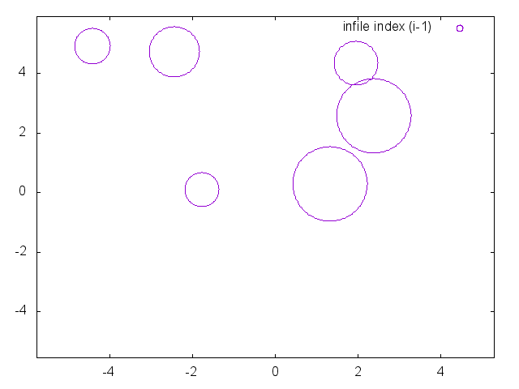

# Gas Simulator

## What
This is a simple 2 dimensional, elastic particle simulator, written for funand
to learn Rust. It comes with a simple script to run the simulation and generate
a gif of the result using gnuplot.

The simulation is exact (to within floating point error and as far as I've been
able to confirm), not relying on error-prone timestep-based physics
simulations. As a result, it is quite efficient: it only performs the necessary
`O(N^2)` collision checks once per collision (not per timestep), and its memory
footprint is at most 2 vectors containing N particles. On the other hand, due
to its reliance on geometric formulas, it is not easily extensible to higher
dimensionality nor non-spherical particles, as this would require deriving and
implementing the higher dimensional forms.

# How
To run the default simulation and generate a gif, do:

```
$ ./run.sh test1
Output in tmp/test1.(gif|dat|log)
```

which will generate a gif like this:



Note: gnuplot seems to be unable to create circles of precise sizes, which
leads to the appearance of overlapping particles. I verified this by adding
checks in the code that logs collisions and erroneous states.

## Requirements
You must have gnuplot installed (I used version 5.0), with the correct
libraries to generate gifs.

This was easy enough with brew, but YMMV.

